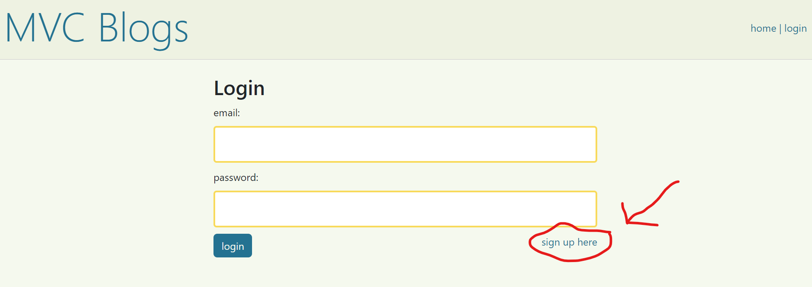
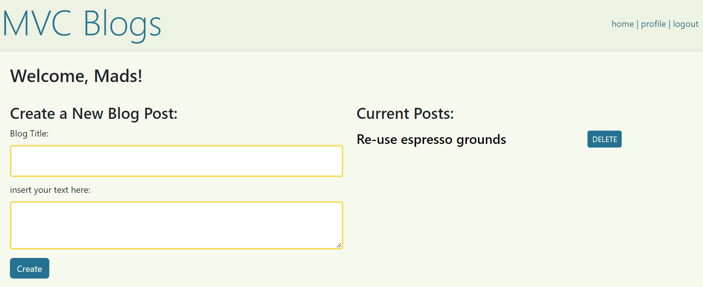
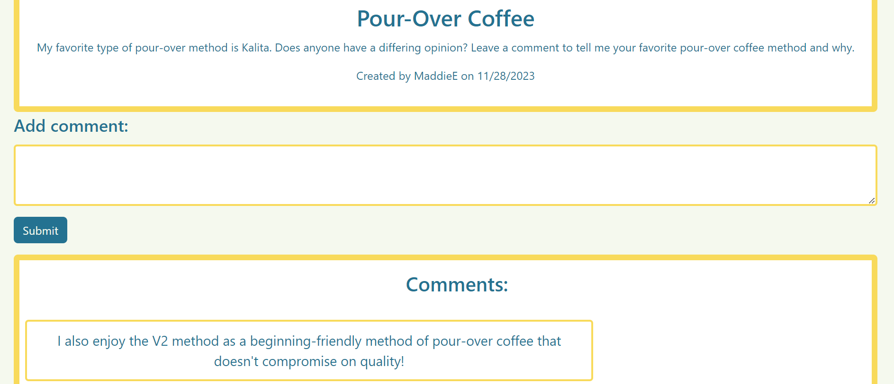

# MVC-blog-site

## Description

MVC blogs is an application where users can connect by reading and commenting on others blogs, or creating a profile and posting their own blogs. The motivation for the application was a simple MVC blog application with a simple UI, that still had the feel of professionalism and community by using created profiles to interact with other users. In doing this project, I learned how to take existing code and edit it for my UI needs.

## Installation

To install this project, one simple has to open the deployed application provided by Heroku and begin exploring.

## Usage

Once the application is open, a user can browse the home page and look at existing blog posts. If one wants to login or create a profile, they may do so by clicking "login" in the navbar. From the login page, they can click the link to "sign up here", as shown in screenshot 1 below. Once a user has logged in, they may view their profile, where they may add new posts and view all previously added posts, as shown in screenshot 2. Don't forget to click on a blog post to add and view comments, as shown in screenshot 3 below.

## Credits

My boilerplate code was from another application that I worked on with three other members in an organization called the quar-tech. The link to the repository that the boiler plate code is from can be found here: https://github.com/quar-tech/mvc-recipe-sharing 

## License

MIT License
